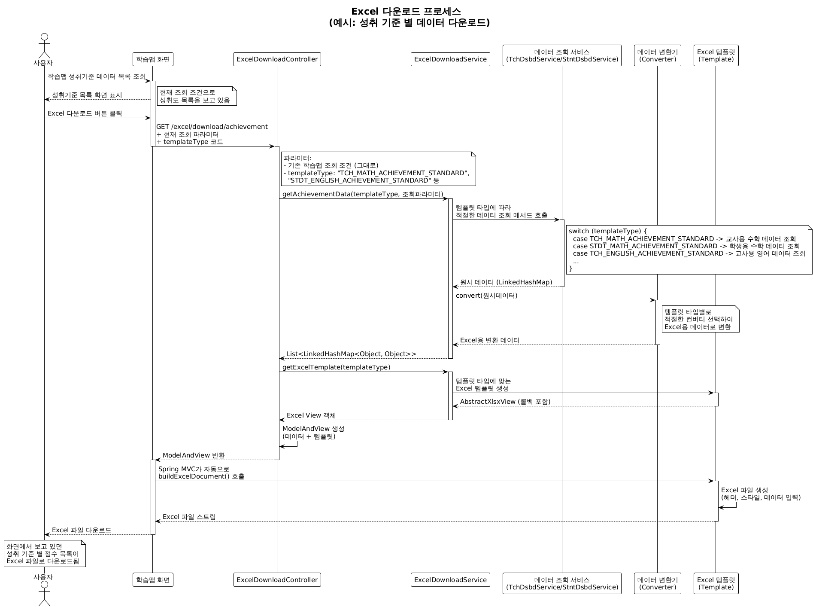

# Excel 다운로드 기능 가이드

## 📋 개요
사용자가 화면에서 보고 있는 데이터를 그대로 Excel 파일로 내보낼 수 있습니다.

## 🏗️ 시스템 구조


### 핵심 컴포넌트
- **Controller**: REST API 엔드포인트 제공
- **Service**: 데이터 조회 및 Excel 템플릿 생성 조율
- **Converter**: 원시 데이터를 Excel용 데이터로 변환
- **Template**: Excel 파일 생성 및 스타일링

### 설계 패턴
- **전략 패턴**: 템플릿 타입별로 다른 변환기와 템플릿 사용
- **콜백 패턴**: Spring MVC와 Excel 생성 로직 분리
- **팩토리 패턴**: 템플릿 타입에 따른 적절한 구현체 생성

## 🚀 현재 구현된 기능

### 1. 성취기준별 학습 현황 Excel 다운로드
**API 엔드포인트**: `GET /excel/download/achievement`

**지원 템플릿**:
- `TCH_MATH_ACHIEVEMENT_STANDARD`: (교사)수학 성취기준별 학습 현황
- `STDT_MATH_ACHIEVEMENT_STANDARD`: (학생)수학 성취기준별 학습 현황
- `TCH_ENGLISH_ACHIEVEMENT_STANDARD`: (교사)영어 성취기준별 학습 현황
- `STDT_ENGLISH_ACHIEVEMENT_STANDARD`: (학생)영어 성취기준별 학습 현황

## 📈 새로운 기능 추가 가이드

### 이해도 Excel 다운로드 추가 예시

#### 1. ExcelTemplateType enum 확장

```java
public enum ExcelTemplateType {
    // 기존 성취도
    TCH_MATH_ACHIEVEMENT_STANDARD("TCH_MATH_ACHIEVEMENT_STANDARD", "(교사)수학 성취기준별 학습 현황"),
    STDT_MATH_ACHIEVEMENT_STANDARD("STDT_MATH_ACHIEVEMENT_STANDARD", "(학생)수학 성취기준별 학습 현황"),
    TCH_ENGLISH_ACHIEVEMENT_STANDARD("TCH_ENGLISH_ACHIEVEMENT_STANDARD", "(교사)영어 성취기준별 학습 현황"),
    STDT_ENGLISH_ACHIEVEMENT_STANDARD("STDT_ENGLISH_ACHIEVEMENT_STANDARD", "(학생)영어 성취기준별 학습 현황"),
    
    // 새로운 이해도 추가
    TCH_MATH_UNDERSTANDING("TCH_MATH_UNDERSTANDING", "(교사)수학 이해도 현황"),
    STDT_MATH_UNDERSTANDING("STDT_MATH_UNDERSTANDING", "(학생)수학 이해도 현황"),
    TCH_ENGLISH_UNDERSTANDING("TCH_ENGLISH_UNDERSTANDING", "(교사)영어 이해도 현황"),
    STDT_ENGLISH_UNDERSTANDING("STDT_ENGLISH_UNDERSTANDING", "(학생)영어 이해도 현황");
}
```

#### 2. 새로운 데이터 변환기 인터페이스 생성

```java
public interface UnderstandingDataConverter {
    List<LinkedHashMap<Object, Object>> convert(LinkedHashMap<String, Object> rowData);
}
```

#### 3. 구현체 작성

```java
@Component
public class MathUnderstandingDataConverter implements UnderstandingDataConverter {
    @Override
    public List<LinkedHashMap<Object, Object>> convert(LinkedHashMap<String, Object> rowData) {
        // 이해도 데이터 변환 로직 구현
        // - 원시 데이터 파싱
        // - Excel용 데이터 구조로 변환
        // - 필요시 계산 로직 추가
    }
}

@Component
public class EnglishUnderstandingDataConverter implements UnderstandingDataConverter {
    @Override
    public List<LinkedHashMap<Object, Object>> convert(LinkedHashMap<String, Object> rowData) {
        // 영어 이해도 변환 로직
    }
}
```

#### 4. ConverterConfig 확장

```java
@Configuration
public class ConverterConfig {
    
    @Bean
    public Map<ExcelTemplateType, AchievementDataConverter> achievementConverters(...) {
        // 기존 성취도 컨버터들
        converters.put(ExcelTemplateType.TCH_MATH_ACHIEVEMENT_STANDARD, mathConverter);
        converters.put(ExcelTemplateType.STDT_MATH_ACHIEVEMENT_STANDARD, mathConverter);
        converters.put(ExcelTemplateType.TCH_ENGLISH_ACHIEVEMENT_STANDARD, englishConverter);
        converters.put(ExcelTemplateType.STDT_ENGLISH_ACHIEVEMENT_STANDARD, englishConverter);
    }
    
    @Bean
    public Map<ExcelTemplateType, UnderstandingDataConverter> understandingConverters(
        MathUnderstandingDataConverter mathConverter,
        EnglishUnderstandingDataConverter englishConverter
    ) {
        Map<ExcelTemplateType, UnderstandingDataConverter> converters = new EnumMap<>(ExcelTemplateType.class);
        converters.put(ExcelTemplateType.TCH_MATH_UNDERSTANDING, mathConverter);
        converters.put(ExcelTemplateType.STDT_MATH_UNDERSTANDING, mathConverter);
        converters.put(ExcelTemplateType.TCH_ENGLISH_UNDERSTANDING, englishConverter);
        converters.put(ExcelTemplateType.STDT_ENGLISH_UNDERSTANDING, englishConverter);
        return converters;
    }
}
```

#### 5. Service에 이해도 메서드 추가

```java
@Service
public class ExcelDownloadService {
    
    private final Map<ExcelTemplateType, AchievementDataConverter> achievementConverters;
    private final Map<ExcelTemplateType, UnderstandingDataConverter> understandingConverters;
    
    // 기존 메서드
    public List<LinkedHashMap<Object, Object>> getAchievementData(...) { ... }
    
    // 새로운 메서드
    public List<LinkedHashMap<Object, Object>> getUnderstandingData(
        ExcelTemplateType templateType, 
        Map<String, Object> searchParams
    ) throws Exception {
        LinkedHashMap<String, Object> rawData = fetchUnderstandingRawData(templateType, searchParams);
        UnderstandingDataConverter converter = understandingConverters.get(templateType);
        if (converter == null) {
            throw new IllegalArgumentException("지원하지 않는 템플릿 타입입니다: " + templateType);
        }
        return converter.convert(rawData);
    }
    
    private LinkedHashMap<String, Object> fetchUnderstandingRawData(
        ExcelTemplateType templateType, 
        Map<String, Object> searchParams
    ) throws Exception {
        return switch (templateType) {
            case TCH_MATH_UNDERSTANDING -> (LinkedHashMap<String, Object>) 
                tchDsbdService.selectTchDsbdUnderstandingData(searchParams);
            case STDT_MATH_UNDERSTANDING -> (LinkedHashMap<String, Object>) 
                stntDsbdService.selectStntDsbdUnderstandingData(searchParams);
            case TCH_ENGLISH_UNDERSTANDING -> (LinkedHashMap<String, Object>) 
                tchDsbdService.selectTchDsbdEnglishUnderstandingData(searchParams);
            case STDT_ENGLISH_UNDERSTANDING -> (LinkedHashMap<String, Object>) 
                stntDsbdService.selectStntDsbdEnglishUnderstandingData(searchParams);
        };
    }
    
    // getExcelTemplate 메서드는 공통으로 사용 (새 템플릿만 추가)
}
```

#### 6. Controller에 새 엔드포인트 추가

```java
@RestController
@RequestMapping("/excel/download")
public class ExcelDownloadController {
    
    // 기존 메서드
    @RequestMapping(value = "/achievement", method = {RequestMethod.GET})
    public ModelAndView downloadAchievementExcel(...) { ... }
    
    // 새 메서드
    @RequestMapping(value = "/understanding", method = {RequestMethod.GET})
    @Operation(summary = "이해도 현황 Excel 다운로드", description = "이해도 현황을 Excel 파일로 다운로드합니다.")
    public ModelAndView downloadUnderstandingExcel(
        @Parameter(hidden = true) @RequestParam Map<String, Object> paramData
    ) throws Exception {
        
        String templateTypeStr = MapUtils.getString(paramData, "templateType");
        ExcelTemplateType templateType = ExcelTemplateType.fromCode(templateTypeStr);

        List<LinkedHashMap<Object, Object>> data = excelDownloadService.getUnderstandingData(templateType, paramData);
        AbstractXlsxView view = excelDownloadService.getExcelTemplate(templateType);

        String filename = String.format("%s.xlsx", templateType.getDescription());
        ModelAndView mav = new ModelAndView();
        mav.setView(view);
        mav.addObject("filename", filename);
        mav.addObject("data", data);

        return mav;
    }
}
```

#### 7. Excel 템플릿 구현

```java
@Slf4j
public class TchMathUnderstandingExcelTemplate implements ExcelTemplateCallback {

    @Override
    public ExcelTemplateType getTemplateType() {
        return ExcelTemplateType.TCH_MATH_UNDERSTANDING;
    }

    @Override
    public void buildExcelWorkbook(Map<String, Object> model, Collection<?> data, Workbook workbook) {
        // 이해도 전용 Excel 템플릿 구현
        // - 시트 생성
        // - 헤더 스타일 정의
        // - 데이터 스타일 정의
        // - 데이터 채우기
        // - 컬럼 너비 조정
    }
}
```

## 🔄 데이터 흐름

```
1. 사용자가 화면에서 학습 현황 조회
2. Excel 다운로드 버튼 클릭
3. 현재 조회 조건 + templateType으로 API 호출
4. Service에서 데이터 조회 → Converter로 변환 → Template 생성
5. Spring MVC가 Excel 파일 생성 및 다운로드 처리
```

## 📝 주의사항

### 개발 시 고려사항
1. **데이터 타입별 분리**: 성취도와 이해도는 별도의 인터페이스와 구현체 사용
2. **템플릿 재사용**: 기존 `getExcelTemplate()` 메서드는 공통으로 사용
3. **에러 처리**: 지원하지 않는 템플릿 타입에 대한 예외 처리 필수
4. **테스트**: 각 Converter와 Template에 대한 단위 테스트 필수

### 성능 고려사항
- 대용량 엑셀 데이터 처리 시 메모리 사용량 모니터링
- Excel 생성 시간이 긴 경우 비동기 처리 고려

## 📚 참고자료
- Apache POI Excel 생성 가이드
- 전략 패턴(Strategy Pattern), 템플릿 패턴(template Pattern), 펙토리 패턴(factory Pattern) 설계 문서